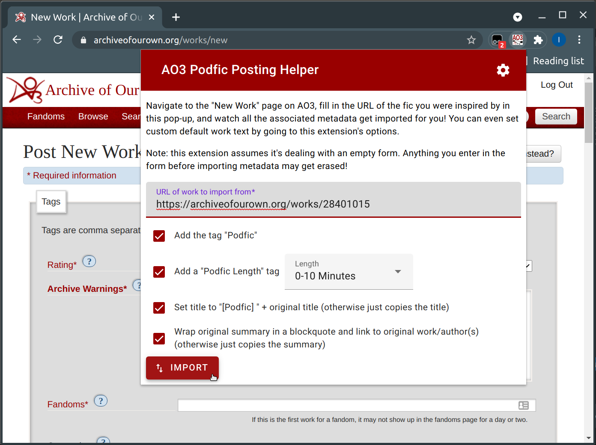
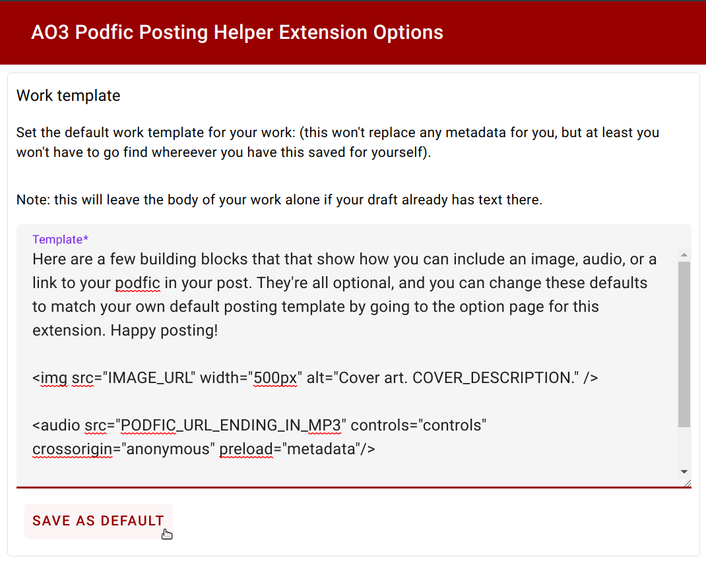

# AO3 Podfic Posting Helper

When you post a new work, this extension can help you by importing metadata such as tags and rating to match the work that inspired you.

_This is an unofficial extension and not supported by AO3_. Please do not raise issues with this extension to AO3 support.

[Available on the Chrome Web Store](https://chrome.google.com/webstore/detail/ao3-podfic-posting-helper/liceoplaldpcfdkndimfppgdcbophgma)

You can configure it to:

*   Automatically add the "Podfic" tag
*   Automatically add a "Podfic Length: X" tag
*   Add a "[Podfic] " prefix to your title
*   Wrap the original summary in a blockquote and link to that work and its authors

You can also configure a custom default body for your work, instead of a default which demonstrates how to embed audio, images, or links.

## Contrib

Feel free to send a pull-request if you have ideas to improve this project, although this is a side project so if it's a large contribution it might be a while before it gets reviewed.

While you're working on the project, the easiest way to test your local changes is to go to chrome://extensions in your chrome browser, turn developer mode on, and load the "chrome-extension" folder as an unpacked extension. Note that users who have "Show me adult content without checking" off will get a warning page when importing from a mature or explicit work, so if you're changing how metadata is imported you should probably check against both page formats.

## Documentation

A lot of the basic structure of this app (popup page/option page/background loader) was built directly on the Chrome extension [getting started tutorial](https://developer.chrome.com/docs/extensions/mv3/getstarted/).

### popup.js

The core importing logic that gets the metadata from the original work, and the filling logic, to enter it into AO3's new work form. There's also some logic here to save pop-up options when a user hits import, so that they'll be the same next time.

### Storing options

The only way to pass information between the form fields in the pop-up and the injected html that fills in the "new work" form is to write it to storage and then read it back. That's what the chrome.storage.sync.set/get calls do.

### Code design

The pop-up and options page are built using [Material Design Components for Web](https://material.io/). We using the web components without a framework and with barebones CSS. The JS and CSS files for the components were downloaded from CDN and are packed in source here. We didn't set up any kind of package management with Node or any bundling with tools like Webpack on account of these being more effort than we were willing to invest right now. Code is organized as ES6 modules where possible.
