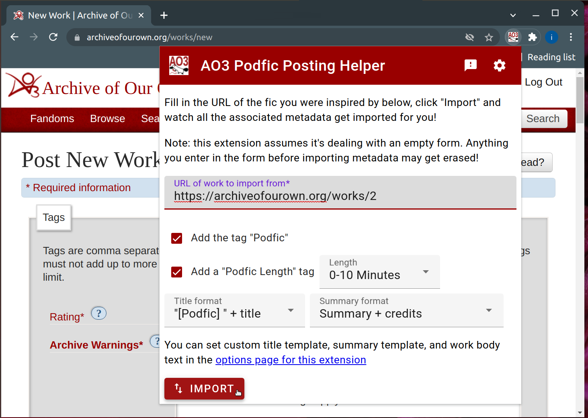

# AO3 Podfic Posting Helper

When you post a new work, this extension can help you by importing metadata such as tags and rating to match the work that inspired you.

_This is an unofficial extension and not supported by AO3_. Please do not raise issues with this extension to AO3 support.

[Available on the Chrome Web Store](https://chrome.google.com/webstore/detail/ao3-podfic-posting-helper/liceoplaldpcfdkndimfppgdcbophgma?utm_source=github&utm_medium=web&utm_campaign=readme)

[Available as a Firefox Add-on](https://addons.mozilla.org/en-US/firefox/addon/ao3-podfic-posting-helper/)

You can configure it to:

*   Automatically add the "Podfic" tag
*   Automatically add a "Podfic Length: X" tag
*   Apply a transformation to the original title, such as adding the prefix "[Podfic] "
*   Apply a transformation to the original summary, such as wrapping it in a blockquote and linking to that work and its authors

If the default set of title transformations isn't enough, you can configure a custom format on the options page. "**\${title}**" will be replaced with the original title and "**\${authors}**" with the original authors.

For example, if the original work is called "Super awesome title" and is by
"author1" and "author2":

*   "**\${title}**" will give you "Super awesome title"
*   "[Podfic] **\${title}**" will give you "[Podfic] Super awesome title"
*   "podfic of **\${title}** by **\${authors}**"
    will give you "podfic of Super awesome title by author1, author2"

If the default set of summary transformations isn't enough, you can configure a custom format on the options page. The following replacements will be made:

*   **\${blocksummary}**: The summary of the original work wrapped in a blockquote. Because of the way ao3 handles block quotes, you should put whatever you want to follow this on the same line.
*   **\${summary}**:The summary of the original work.
*   **\${title}**: The title of the original work. This will be a link to the original work.
*   **\${authors}**: A comma-separated list of the authors of the original work. Each author is a link to their AO3 page.

You can also configure a custom default body for your work, instead of a default which demonstrates how to embed audio, images, or links.

## Documentation

A lot of the basic structure of this app (popup page/option page/background loader) was built directly on the Chrome extension [getting started tutorial](https://developer.chrome.com/docs/extensions/mv3/getstarted/).

### popup.js

The core importing logic that gets the metadata from the original work, and the filling logic, to enter it into AO3's new work form. There's also some logic here to save pop-up options when a user hits import, so that they'll be the same next time.

### Storing options

The only way to pass information between the form fields in the pop-up and the injected html that fills in the "new work" form is to write it to storage and then read it back. That's what the `browser.storage.sync.set`/`get` calls do.

### Code design

The pop-up and options page are built using [Material Design Components for Web](https://material.io/). We are using the web components without a framework and with barebones CSS. The JS and CSS files for the components were downloaded from CDN and are packed in source here. We didn't set up any kind of package management with Node or any bundling with tools like Webpack on account of these being more effort than we were willing to invest right now. Code is organized as ES6 modules where possible.
